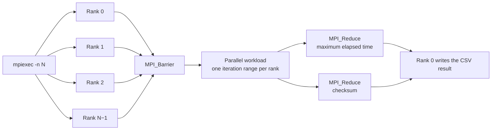
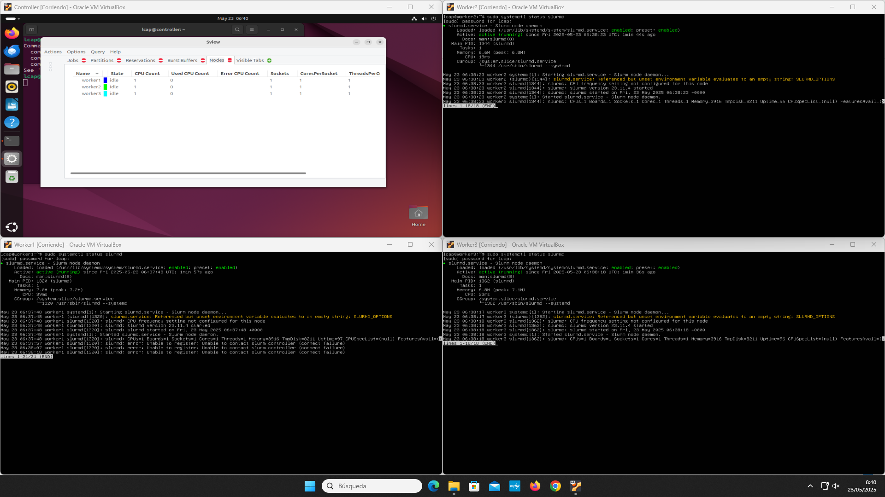

# High Performance Computing Labs

This repository presents three coursework laboratories completed during the 2024/2025 course *Sistemas Computadores de Altas Prestaciones* in Spain. Together they form a progression from shared-memory parallelism, to multi-process execution, to the deployment of a small managed cluster.

## What the repository contains

| Laboratory | Model | Technology | Main objective |
| --- | --- | --- | --- |
| 1 | Shared memory | OpenMP | Measure how a synthetic workload scales as the number of threads increases |
| 2 | Multiple processes | Microsoft MPI | Compare process-based parallelism with the OpenMP experiment |
| 3 | Distributed cluster | Ubuntu Server, Munge and Slurm | Build and validate a controller-and-workers cluster in VirtualBox |

Each laboratory includes a bilingual assignment overview, an implementation or configuration section, recorded results, and notes for reproducing the work. See [Methodology and reproducibility](docs/methodology.md) for the experimental scope and interpretation guidelines.

## Laboratory 1 OpenMP

The first laboratory parallelizes a simple synthetic loop using an explicit cyclic distribution of iterations. The measurements cover 1 to 20 threads and additional oversubscription experiments with 60, 120 and 240 threads.

The benchmark ran on an Intel Core i7-12700. Its hybrid topology matters when interpreting the results: the processor contains 8 Performance cores with Hyper-Threading and 4 Efficiency cores, for 12 physical cores and 20 logical threads. It should not be modeled as 10 identical physical cores.

[Open the OpenMP laboratory](openmp/README.md)

## Laboratory 2 MPI

The second laboratory implements the same general workload with independent MPI processes. Each process receives a portion of the iteration range, while the root process records the maximum elapsed time across the workers. The experiments include both a lightweight multiplication and a more expensive mathematical workload.



*`mpiexec` launches independent ranks, which synchronize before processing their assigned ranges. Rank 0 collects the maximum elapsed time and checksum.*

[Open the MPI laboratory](mpi/README.md)

## Laboratory 3 Slurm cluster

The final laboratory deploys Ubuntu Server virtual machines connected through a NAT interface and an internal network. A controller provides shared storage through NFS and coordinates the cluster through Slurm. Munge authenticates messages between the nodes. The initial cluster used two workers; the optional extension added `worker3`, producing this final topology:

```text
controller  192.168.10.10  Slurm controller and NFS server
worker1     192.168.10.11  compute node
worker2     192.168.10.12  compute node
worker3     192.168.10.13  additional compute node
```



*The final environment combines the Sview node overview with active `slurmd` services on all three workers.*

[Open the Slurm cluster laboratory](slurm-cluster/README.md)

## Important methodological note

The course benchmark repeatedly assigned the constant product `b * c` to a private variable. In an optimized build, a compiler may simplify or remove this work because it has no observable effect. The measurements are useful for studying the exercise, but they should not be treated as a rigorous modern CPU benchmark.

The implementations in this repository preserve the explicit work distribution requested by the assignment while accumulating and printing a checksum. This gives the computation an observable result and makes aggressive dead-code elimination less likely. The supplied course runs remain separate from any new measurements.

## Assignment documents

Each laboratory contains a Spanish summary and an English version of the assignment requirements. Course handouts are kept outside the repository because their redistribution rights belong to the original authors.

## Build

The CMake configuration exposes the two benchmarks as independent options. For example, a machine with OpenMP but no MPI installation can build only the first laboratory:

```text
cmake -S . -B build -DHPC_BUILD_MPI=OFF
cmake --build build --config Release
```

Likewise, `-DHPC_BUILD_OPENMP=OFF` selects only the MPI target. The Slurm section is documentation and does not produce a local executable.
