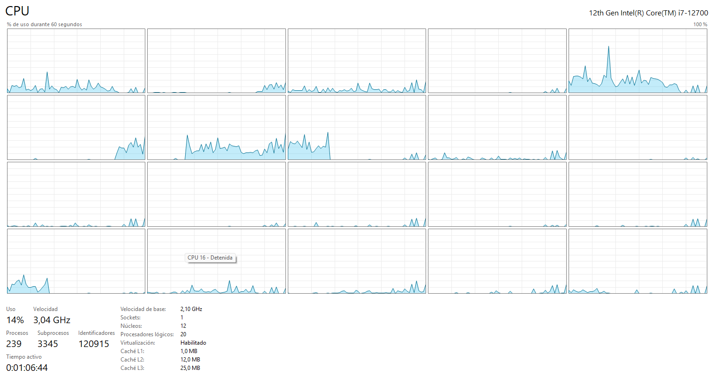
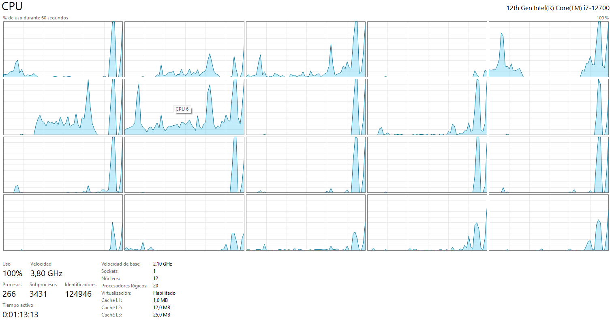

# MPI Multi Process Benchmark

## Purpose

This laboratory revisits the synthetic workload using separate MPI processes. It introduces ranks, communicators, barriers and reductions, then compares process-based scaling with the OpenMP results from the same machine.

## Course experiment

- the MPI benchmark implementation;
- six complete result logs;
- Task Manager screenshots for selected process counts and workloads;
- a Windows batch file used to launch process-count sweeps.

`src/benchmark_mpi.cpp` implements the workload with complete quotient-and-remainder distribution and a checksum reduction.

## Implementation

The implementation:

- accepts the operation count and number of repetitions as arguments;
- divides both the quotient and remainder of the iteration range;
- synchronizes ranks before each timed kernel;
- uses the maximum rank time as the parallel elapsed time;
- reduces a checksum so the workload has an observable result;
- prints one CSV row per repetition from rank zero.

Example:

```text
mpiexec -n 12 benchmark_mpi 100000000 5
```

## Timing boundary

`MPI_Wtime` measures the distributed kernel after all ranks have started. It does not include the cost of launching processes through `mpiexec`. This distinction should be explicit in any performance claim. End-to-end time must be measured outside the executable.

## Workloads

The recorded data includes variants of the constant multiplication and a heavier expression using trigonometric, logarithmic, square-root and power functions. These series show how the computation-to-overhead ratio changes the observed scaling.

### Lightweight workload

In the captured run, the multiplication-based workload does not keep every logical processor continuously busy. Process-management and synchronization costs are therefore significant relative to the useful computation.



*The lighter run reaches only 14% total CPU utilization in this capture, with activity distributed unevenly across the 20 logical processors.*

### Compute-intensive workload

The mathematical variant performs substantially more work per iteration. This increases the computation-to-overhead ratio and produces much higher processor utilization.



*The heavier run reaches 100% total CPU utilization. The individual graphs also show that process scheduling is dynamic rather than permanently tied to one visible graph.*

Additional captures for other process counts and workloads are listed in the [MPI evidence index](evidence/README.md).

See [the bilingual assignment summary](assignment.md).
