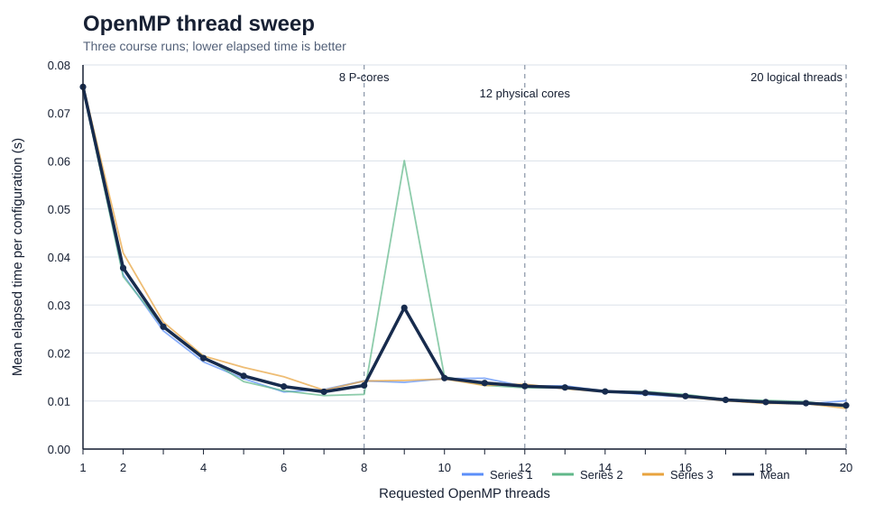

# OpenMP Shared Memory Benchmark

## Purpose

This laboratory studies the scaling of a synthetic loop on a shared-memory multicore processor. Iterations are distributed explicitly: thread `t` executes `t`, `t + team_size`, `t + 2 * team_size`, and so on.

## Course experiment

- five sequential timing measurements;
- three OpenMP result series for 1 to 20 threads;
- extra runs with 60, 120 and 240 threads;
- the OpenMP benchmark implementation;
- a hardware profile of the laboratory machine.

Recorded measurements are stored under `results/course-runs/`. The implementation under `src/` adds a checksum while preserving the explicit cyclic distribution required by the assignment.

## Implementation

`src/benchmark_openmp.cpp` keeps the explicit cyclic distribution required by the assignment, performs a real reduction, prints a checksum, and produces one CSV row per measurement.

Example command after compiling with OpenMP support:

```text
benchmark_openmp 100000000 20 5 --oversubscribe
```

Arguments:

1. total number of loop iterations;
2. maximum normal thread count;
3. repetitions per configuration;
4. optional `--oversubscribe`, which adds 60, 120 and 240 threads.

## How to interpret the measurements

The three normal result files show rapid improvement through the first six or seven threads, followed by a noisier region. One run contains a pronounced outlier at nine threads. This is plausible on a shared laboratory machine, but the benchmark design and build settings do not support a strong causal conclusion.



The dashed markers are architectural capacity landmarks. They do not imply that Windows assigned a particular software thread to a particular core type during these runs.

The oversubscription measurements do not consistently become slower. That result should not be described simply as proof that hundreds of threads improve performance. The constant workload, compiler optimization risk, runtime thread pool, short measurement interval and heterogeneous CPU all affect the observation.

## Re-running the experiment

For a new result set:

- compile an optimized and a debug build and record both configurations;
- disable dynamic OpenMP team sizing;
- run on an otherwise idle system;
- record every repetition, not only the mean;
- report median, mean and dispersion;
- record thread affinity and processor topology;
- store new measurements in a separate output folder.

See [the bilingual assignment summary](assignment.md) and [the verified hardware description](../docs/hardware.md).
