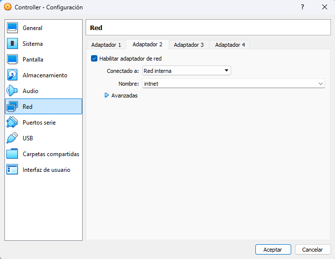
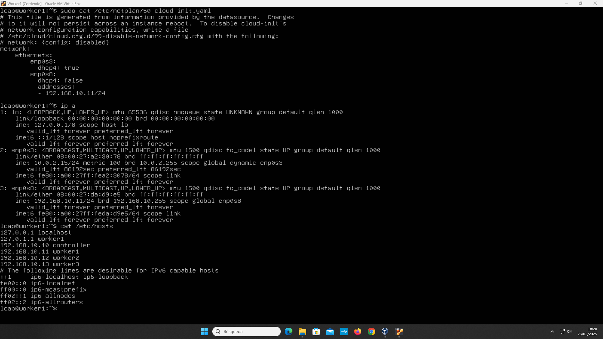
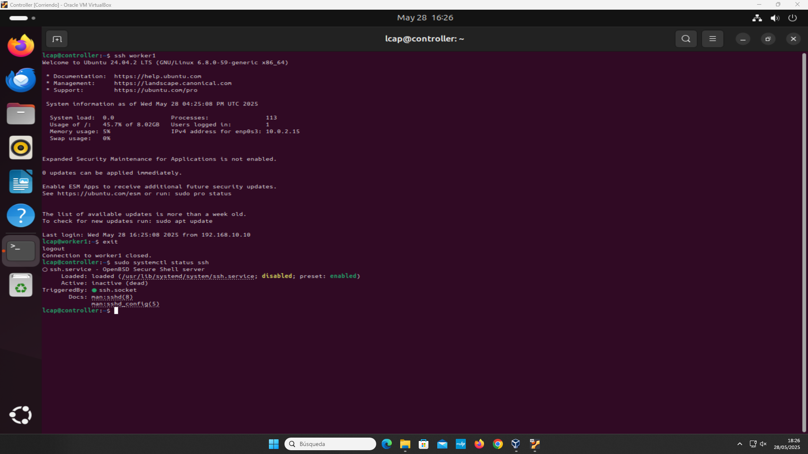
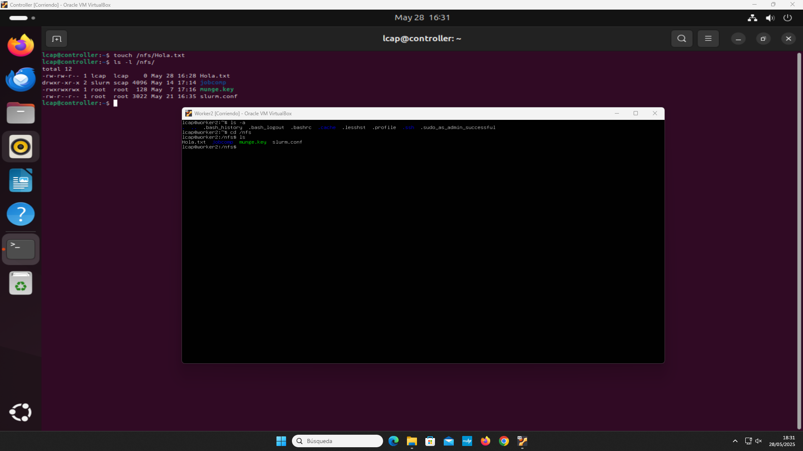
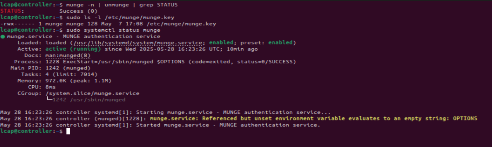

# Ubuntu and Slurm Cluster

## Purpose

This laboratory builds a small HPC cluster in Oracle VirtualBox. It connects Ubuntu Server nodes through a private Ethernet network, enables passwordless administration, shares storage through NFS, authenticates the nodes with Munge, and schedules work with Slurm.

## Final topology

```text
                    NAT network
                        |
                 +-------------+
                 | controller  |
                 | .10         |
                 | NFS + Munge |
                 | slurmctld   |
                 +------+------+
                        |
             internal network 192.168.10.0/24
              +---------+---------+
              |         |         |
          worker1    worker2    worker3
          .11        .12        .13
          slurmd     slurmd     slurmd
```

The core task initially used `controller`, `worker1` and `worker2`. The professor's additional task asked for a cloned `worker3`; the final screenshots verify that it was added.

## Deployment procedure

### 1. Virtual machines and private network

The controller and workers run Ubuntu Server 24.04 LTS in VirtualBox. Every VM has a NAT adapter for package installation and an internal `intnet` adapter dedicated to cluster traffic.



*Adapter 2 connects the controller to the isolated VirtualBox network named `intnet`.*

Static addresses from `192.168.10.10` to `192.168.10.13` provide predictable node identities. Matching `/etc/hosts` entries allow the machines to communicate through the names `controller`, `worker1`, `worker2`, and `worker3`.



*The `worker1` terminal verifies its `192.168.10.11/24` address and the complete four-node host map.*

### 2. Remote access and shared storage

OpenSSH provides administrative access between the nodes. Connectivity is tested from the controller before the distributed services are configured.



*A successful SSH session confirms hostname resolution and connectivity between the controller and `worker1`.*

The controller exports `/nfs`, and every worker mounts the same directory. A file created on the controller is therefore immediately visible from a compute node.



*`Hola.txt` appears in `/nfs` on both machines, validating the shared filesystem.*

### 3. Authentication and Slurm services

Munge signs and validates credentials exchanged by Slurm. All nodes use the same protected `munge.key`; the service status and an encode/decode test confirm that authentication works.



*The credential pipeline reports `STATUS: Success (0)`, and `munge.service` is active.*

Slurm runs `slurmctld` on the controller and `slurmd` on each worker. The service capture verifies that all four daemons are active at the same time.


*The controller daemon and the three compute-node daemons report `active (running)`.*

### 4. Cluster validation

The node state is checked with `sinfo` and the Sview graphical interface. The final view displays `worker1`, `worker2`, and `worker3`, each configured with one virtual CPU.


*Sview lists all three workers while the accompanying terminals show their running `slurmd` services.*

The final functional test uses `srun -N3 hostname` to request execution across all three compute nodes.

## Configuration files

The files under `config/` document the addressing, host mapping, netplan setup, and Slurm node definition used in the laboratory. They are focused examples rather than a complete automated deployment or a drop-in production configuration.

## Additional evidence

The evidence directory also documents the VirtualBox CPU, memory, disk and NAT settings, the Slurm node definition, and the final multi-node command. Every screenshot has a descriptive filename and an explanation in the index.

[Browse the evidence index](evidence/README.md)

See [the bilingual assignment summary](assignment.md).
