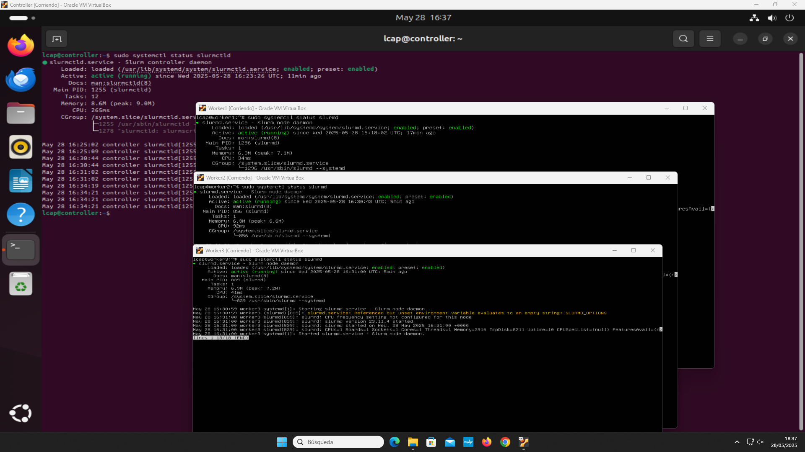

# Ubuntu and Slurm Cluster

## Purpose

This laboratory builds a small HPC cluster in Oracle VirtualBox. It connects Ubuntu Server nodes through a private Ethernet network, enables passwordless administration, shares storage through NFS, authenticates the nodes with Munge, and schedules work with Slurm.

## Final topology

```text
                    NAT network
                        |
                 +-------------+
                 | controller  |
                 | .10         |
                 | NFS + Munge |
                 | slurmctld   |
                 +------+------+
                        |
             internal network 192.168.10.0/24
              +---------+---------+
              |         |         |
          worker1    worker2    worker3
          .11        .12        .13
          slurmd     slurmd     slurmd
```

The core task initially used `controller`, `worker1` and `worker2`. The professor's additional task asked for a cloned `worker3`; the final screenshots verify that it was added.

## Deployment procedure

1. Create the controller and worker virtual machines with Ubuntu Server 24.04 LTS.
2. Give each VM a NAT adapter for internet access and an internal adapter for cluster traffic.
3. Configure static internal addresses and consistent `/etc/hosts` entries.
4. Install OpenSSH and verify key-based connections between nodes.
5. Export `/nfs` from the controller and mount it persistently on the workers.
6. Install Munge, distribute one shared `munge.key`, and validate cross-node credentials.
7. Install Slurm, run `slurmctld` on the controller and `slurmd` on each worker.
8. Check node state with `sinfo` and the Sview graphical interface.
9. Add `worker3` by cloning a worker, changing its hostname and address, and updating the shared configuration.

## Configuration examples

The files under `config/` document the addressing, host mapping, netplan setup, and Slurm node definition used in the laboratory. They are focused examples rather than a complete automated deployment or a drop-in production configuration.

## Validation

The final screenshots show:

- the internal address and host map on `worker1`;
- active `slurmctld` and `slurmd` services;
- a Slurm node expression covering `worker1`, `worker2` and `worker3`;
- the three compute nodes visible in Sview;
- the command `srun -N3 hostname` used as the final multi-node test.

The screenshots are organized under `evidence/` with descriptive filenames.



[Browse the evidence index](evidence/README.md)

See [the bilingual assignment summary](assignment.md).
